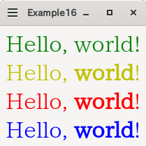

# GtkLabelの文字装飾

このサンプルは、`GtkLabel`の文字装飾を試してみました。
4パターンを試してみました。



## スタイルシートで指定する。

`GtkLabel`に限った話ではなく、GTKのウィジェットはスタイルシートで見栄えを変更するようになっています。
サンプルでは、以下のようなスタイルシートを用意しています。

```css
label.label1 {
	color: #008000;
	font-size: 24pt;
	font-family: Serif;
}
```

見てのとおり、Webのスタイルシートとほぼ同じだと思っていいです。

`GtkLabel`に限った話ではなく、全てのウィジェットに通用するやり方ですが、言い換えると`GtkLabel`固有の機能、具体的に言えば文字の一部のみを変更するといったことはできません。
(サンプルでも、「world」だけボルド体にすることはしていません)

`GtkCssProvider`インスタンスを作成し、スタイルシートを読み込み、`gtk_style_context_add_provider_for_display`関数で登録します。
`gtk_widget_get_style_context`関数と`gtk_style_context_add_provider`関数で固有のウィジェットのみにスタイルシートを適用することもできますが、バージョン4.10からはdeprecatedになっています。

セレクタに関しては、以下のようになっています。

### 要素(タグ)

要素は、GTKのクラスに相当します。とはいっても、`GtkLabel`といった名前ではなく、`gtk_widget_class_set_css_name`で設定した名前になっています。
(`GtkLabel'の場合は、「`label`」です。GTKのウィジェットに関しては、マニュアルの「CSS nodes」をご覧ください。)

もちろん、自分で定義したウィジェットクラスも、`gtk_widget_class_set_css_name`で設定して使うことができます。

### ID

```cs
#hoge {
}
```

というように「`#`」をつけた名前は、`GtkWidget::name`プロパティの名前に相当します。

### クラス

```css
.hoge {
}
```

というように「`.`」をつけた名前は、クラス名です。
`gtk_widget_add_css_class`関数でウィジェットに設定したり、UIファイルでは

```xml
	<object class="GtkLabel">
		<style>
			<class name="hoge" />
		</style>
	</object>
```

というように設定します。

## マークアップで指定する。

`GtkLabel::use-markup`プロパティに`true`を指定すると、`GtkLabel::label`プロパティで指定するテキストがマークアップ言語として処理されます。
マークアップの書式に関しては、[Pangoのマニュアルの「Text Attributes and Markup」](https://docs.gtk.org/Pango/pango_markup.html)をご覧ください。

指定するのは楽ですが、いったん指定したものの一部を変更するといった場合にはマークアップを解釈しないといけないので、少々面倒です。

## Pango属性で指定する。

`GtkLabel::attributes`プロパティで、文字属性を細かく指定することができます。
サンプルでは、以下のように指定しています。

```python
		attr_list = Pango.AttrList()
		attr_list.insert(Pango.attr_foreground_new(65535, 0, 0))
		attr_list.insert(Pango.attr_size_new(Pango.SCALE * 24))
		attr_list.insert(Pango.attr_family_new('Serif'))
		for start, end in self._get_word_positions():
			attr = Pango.attr_weight_new(Pango.Weight.BOLD)
			attr.start_index = start
			attr.end_index = end
			attr_list.insert(attr)
```

1. `PangoAttrList`クラスのインスタンスを作成する。
2. 各属性に対して、`PangoAttribute`クラスのインスタンスを作成する。(それぞれの属性に対する`new`メソッドがあるのでそれを使うとよい)
3. 一部に適用するのであれば、`PangoAttribute::start_index`と`PangoAttribute::end_index`に範囲を指定する。(**この範囲の値はUTF-8のバイト単位なので、Pythonの場合は注意が必要**)
4. `pango_attr_list_insert`メソッドで属性を追加する。

といった手順になります。

## Pango属性を文字列で指定する。

UIファイルで`GtkLabel::attributes`プロパティを指定する場合には、文字列で指定することになります。
指定の仕方は、[`pango_attr_list_to_string`メソッドのマニュアル](https://docs.gtk.org/Pango/method.AttrList.to_string.html)に書かれています。

具体的には、上記のPango属性の作成と同じように、一つの属性に対しては、

```
<開始位置> <終了位置> <属性タイプ名> <属性値>
```

となっており、複数指定する場合にはそれぞれの属性をカンマ(「`,`」)区切りで指定します。
`<属性タイプ名>`に関しては、[`PangoAttrType`](https://docs.gtk.org/Pango/enum.AttrType.html)列挙体のnick_nameになっています。

プログラムからは、`pango_attr_list_from_string`関数で文字列から`PangoAttrList`を作成することができますが、この関数はPangoのバージョン1.50に追加されたものなので、古い環境では使えないかもしれません。
(ubuntuで言えば、20.04が1.44のようなので、これ以前のものは使えないことになります)


